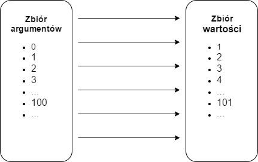

- title : Programowanie funkcyjne (i nie tylko) w F#
- description : Czyli "flexible na przyszłość" w praktyce
- author : Łukasz Kaczanowski
- theme : night
- transition : default

***

### Czego się dzisiaj dowiemy
* Funkcje to nie metody
* Typy to nie klasy
* Kompozycja to nie dziedziczenie
* F# jest całkiem zacny

***

### Funkcje matematyczne

$ f:A \rightarrow  B $

* A - dziedzina, czyli zbiór argumentów funkcji
* B - przeciwdziedzina, czyli zbiór wartości funkcji

---

### Funkcje matematyczne

$ f(x) =  x + 1 $



    let add1 x = x + 1

---

### Cechy funkcji

* zawsze zwraca tą samą wartość dla tego samego argumentu (jest mapą wartości)
* nie może mieć skuktów ubocznych (czystość)
* argumenty oraz wartości funkcji są niezmienne
* ma zawsze jedno wejście i jedno wyjście

---

### Co nam to daje?

* Bardzo uproszczona aplikacja paraleizmu. Locki, mutexy i inne podobne są zbędne.
* *Lazy evaluation* na pierwszym miejscu
* Kolejność wywołania funkcji nie ma (aż tak dużego) znaczenia
* Każda funkcja może być cache'owalna (*memoization*)

***

### Krótko o F#

> **wieloparadygmatowy** język programowania zawierający w sobie głównie cechy języka **funkcyjnego**, ale umożliwiającym także pisanie kodu imperatywnego oraz obiektowego. Jest językiem **silnie typowanym** zaprojektowanym w celu pisania prostego, solidnego i wydajnego kodu do rozwiązywania złożonych problemów. Jest uruchamiany na **platformie .NET**.

---

### Zasady F#

* Domyślnie immutable
* Wszystko jest wyrażeniem (expression), które zwraca wynik
* Funkcje zawsze przyjmują parametry wejściowe i zwracają wynik
* Formatowanie jest ważne
* Kolejność plików jest ważna, aby zapobiec cyklicznym zależnościom

---

### Możliwości F#

* Zaawansowane wnioskowanie typów (type inference)
* Pattern matching + Active Patterns
* Discriminated unions
* Computation Expressions
* Async Workflows + MailboxProcessor (actor pattern)

***
### Expression vs statement

* Celem ```expression``` jest zawsze stworzenie wartości (plus ewentualne skutki uboczne)
* Celem ```statement``` są zawsze skutki uboczne

<!-- sep -->

    [lang=cs]
    // statement
    int result;
    if(retryCount > 5)
    {
        result = -1;
    }

<!-- sep -->

vs

    [lang=cs]
    //expression
    int result = retryCount > 5 ? -1 : 0;

---


*programowanie imperatywne*

<!-- sep -->

    [lang=cs]
    // statement
    var numbers = new List<int> { 1, 2, 3, 4, 5, 6, 7, 8, 9, 10 };
    var evenNumbers = new List<int>();
    foreach (var number in numbers)
    {    
        if (number % 2 == 0)
        {
            evenNumbers.Add(number);
        }
    }

<!-- sep -->

vs

    [lang=cs]
    // expression
    var evenNumbers = numbers.Select(number => number % 2 == 0);

*programowanie deklaratywne*

***

### Funkcje

---

#### Wartości

    let number = 5
    let surname = "Kowalski"

#### Funkcje

    let add x y = x + y
    let sum = add

---

### Currying

    let add x y = x + y
    
    let add' x = fun y -> x + y

---

### Currying

    let add x y = (+) x y

    let three = ((add 1) 2)
    let three' = (((+) 1) 2)

---

### Partial application

    let add x y = (+) x y

    let add10 = (+) 10

---

### Partial application

    let getOblgation connectionString obligationId = ...

    let getObligationIoC = getOblgation @"Server=.;Database=db;Trusted_Connection=True;"

Coś to przypomina?

---

### Pipe

    let (|>) x f = f x

    [1..4]
    |> List.filter (fun i -> i > 2)
    |> List.sum

    let Log level message = sprintf "[%s] - %s" level message
    "some warning" |> Log "Warn"

---

### Kompozycja

    let (>>) f g x = g (f x)

    let add x y = x + y
    let mul x y = x * y

    let add5AndMultiplyBy3 = add 5 >> mul 3

---

### Typ unit

Podobny do ```void```, ale jest typem, a nie słowem kluczowym


    let nothing = ()

    let doNothing () = ()

***

### Kolekcje

---

### Tablica

    let collection = [| 1; 2; 3; 4; 5 |]

    let collection2 = [| 1 .. 5 |]

    let collection3 = [| for i in 1 .. 10 -> i * i  |]

    let third = collection.[2]

    let subCollection = collection.[2..]

---

### Lista

    let collection = [ 1; 2; 3; 4; 5 ]

    let collection2 = [ 1 .. 5 ]

    let collection3 = [ for i in 1 .. 10 -> i * i  ]

    let third = collection.[2]

    let subCollection = collection.[2..]

<!-- sep -->

    let collection4 = collection @ collection2

    let collection5 = 125 :: collection

---

### Sekwencja

```Seq<'T>``` to po prostu ```IEnumerable<T>```

    let sequence = seq { 1 .. 5 }

    let sequence2 = seq { for i in 1 .. 10 -> i * i  }

---

### Użycie

    [1 .. 20 .. 1000]
    |> List.map (fun i -> i * 2)        // select
    |> List.filter (fun i -> i > 20)    // where
    |> List.rev                         // reverse

***

### Typy algebraiczne

---

### Aliasy

    type ClientId = System.Guid
    type DocumentNumber = int
    type DocumentData = string
    type DocumentTuple = DocumentNumber * DocumentData

    type QueryFunction = ClientId -> DocumentTuple list

    let printDocuments (query:QueryFunction) (clientId:ClientId) = 
        clientId |> query |> List.iter (fun doc -> printf "%A" doc)

---

### Tuple


    let intANDstring = (1, "str")

    let t2 = (true, "data")
    let t3 = (1, "data", false)

    let n1 = fst t2
    let n2 = snd t2
    let (b, str) = t2

---

### Rekordy

    type DocumentRecord = 
        { Number: DocumentNumber 
          Data: DocumentData 
          IsSigned: bool }

    let document = { Number = 1; Data = "data"; IsSigned = false }

    let signDocument doc = { doc with IsSigned = true }

    let { Data = d; IsSigned = b } = signDocument document

---

### Unie


    type intORstring = | Int of int | String of string

---

### Unie

    type Shape =
    | Circle of Radius : float
    | Triangle of Base : float * Height : float
    | Rectangle of Length : float * Height : float

--- 

### Unie

    type DocumentRecord' = { Number: DocumentNumber; Data: DocumentData; } 

    type DocumentUnion = 
    | Unsigned of DocumentRecord'
    | Signed of DocumentRecord'

    let signDocument (document: DocumentUnion) =
        match document with
        | Signed _ -> document
        | Unsigned doc -> Signed doc

---

### Pojedyńcze unie

    type SignedDocument = SignedDocument of DocumentRecord'

    type UnsignedDocument = UnsignedDocument of DocumentRecord'

    let signDocument2 (UnsignedDocument record) = SignedDocument record

*** 

### Pattern matching

---

Match po typie

    let printValue optionalInt = 
        match optionalInt with 
        | Some i -> sprintf "Have value %s!" i
        | None -> sprintf "No value"

---

Match warunkowy

    let posNeg number =
        match number with
        | n when n > 0 -> "positive"
        | n when n < 0 -> "negative"
        | _ -> "zero"

---

Match po elementach kolekcji

    let describe list =
        match list with
        | [] -> "empty"
        | [a] -> sprintf "only %A" a
        | [a; _] -> sprintf "two elements beginning with %A" a
        | _ -> "lots of elements"

---

Match używany w funkcji rekurencyjnej

    let rec sum list =
        match list with
        | head :: tail -> head + sum tail
        | [] -> 0

---

Match wartości pola rekordu

    type Person = { First:string; Last:string }

    let matchJohn person = 
        match person with 
        | {First="john"}  -> sprintf "Matched John" 
        | _  -> sprintf "Not John" 

***

### Programowanie obiektowe

---

### Klasy

    type Customer(firstName, lastName) = 

        // default constructor
        new () =
            Customer("john", "doe")

        member this.FirstName = firstName
        member this.LastName = lastName

        member this.GetFullName() = 
            sprintf "%s %s" this.FirstName this.LastName

    let customer = new Customer("John", "Doe")
    let fullName = customer.GetFullName()

---

    type CustomerMutable(firstName, lastName) =

        let mutable _firstName = firstName
        let mutable _lastName = lastBame

        member this.FirstName 
            with get() = _firstName
            with set(value) = _firstName <- value

        member this.LastName
            with get() = _lastName
            and set(value) = _lastName <- value

---

### Interfejsy

    type ICalculator =
        abstract member Add: int -> int -> int
        abstract member Substract: int -> int -> int

        // immutable property
        abstract member Pi : float 

        // read write property
        abstract member CurrentValue : int with get,set

---

    type Calulator() = 
        
        let mutable _currentValue = 0

        interface ICalculator with
            member this.Add x y = x + y
            member this.Substract x y = x - y
            
            member this.Pi = 3.14

            member this.CurrentValue
                with get() = _currentValue
                and set(value) = _currentValue <- value

    let calc = new Calculator()
    let result = calc.Add 1 2

---

### Object expressions

    let calc = 
        { new ICalculator with 
          member this.Add x y = x + y
          member this.Substract x y = x + y
          member this.Pi = 3.14
          member this.CurrentValue with get() = 0 and set(value) = () }


***

### Linki

[http://fsharpforfunandprofit.com/](http://fsharpforfunandprofit.com/)
